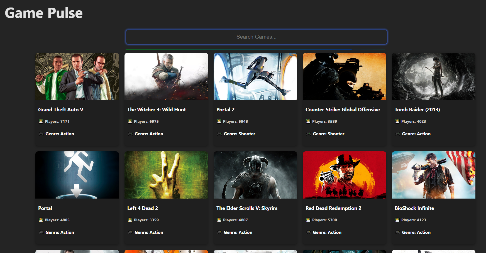

# 🎮 React Games List


---

## 📌 Sobre o projeto

O **React Games List** é um projeto simples desenvolvido para praticar **React**, consumo de APIs e manipulação de estado.  
A aplicação exibe uma lista de jogos populares da API [RAWG](https://rawg.io/apidocs) e permite que o usuário **adicione seus próprios jogos manualmente** com nome, imagem, número de jogadores e gênero.

---

## 🖥️ Demonstração

<p align="center">
  
</p>



---

## 🚀 Funcionalidades

- ✅ Listagem dinâmica de jogos populares via **API RAWG**.  
- ✅ **Cards estilizados** com imagem, título, gênero e número de jogadores.  
- ✅ **Formulário interativo** para adicionar novos jogos manualmente.  
- ✅ Controle de estado com **React Hooks (`useState`, `useEffect`)**.  
- ✅ Layout simples, responsivo e fácil de usar.  

---

## 🛠️ Tecnologias utilizadas

| Tecnologia      | Versão   |
|------------------|----------|
| React.js         | 18.2.0   |
| JavaScript (ES6) | -        |
| CSS3             | 3.0      |
| RAWG API         | v1       |

---

## 📂 Estrutura do projeto

```
📦 react-games-list
 ┣ 📂 src
 ┃ ┣ 📂 components
 ┃ ┃ ┣ 📜 Header.jsx
 ┃ ┃ ┣ 📜 GameCard.jsx
 ┃ ┃ ┗ 📜 AddGameForm.jsx
 ┃ ┣ 📜 App.jsx
 ┃ ┗ 📜 index.jsx
 ┣ 📜 package.json
 ┗ 📜 README.md
```

---

## ⚙️ Como executar o projeto

```bash
# Clonar o repositório
git clone https://github.com/Renannl/GamePulse

# Entrar na pasta
cd react-games-list

# Instalar dependências
npm install

# Iniciar aplicação
npm start
```

## 🌐 Demo online

🔗 [Clique aqui para acessar o projeto](https://game-pulse-delta.vercel.app/)

---

## 📌 Próximos passos

- 🔍 Implementar busca por nome de jogo.  
- 🎨 Melhorar o design com animações e responsividade mobile.  
- ⭐ Criar sistema de favoritos (salvar jogos no LocalStorage).  

---

## 📜 Licença

Este projeto foi desenvolvido para fins de aprendizado.  
Sinta-se à vontade para usar, modificar e compartilhar. ✌️

---

<p align="center">
Feito com 💙 por <a href="https://www.linkedin.com/in/renan-lovo-boni">Renan Lovo Boni</a>
</p>
